<div align="center">


<h1>Maintenance Window Orchestrator Platform</h1>

<p><strong>The Institutional-Grade Platform for Change Coordination, Automated Orchestration, and Zero-Disruption Maintenance Governance</strong></p>

[]()
[]()
[]()
[]()

<br/>

> **"Uncoordinated maintenance is the primary catalyst for institutional downtime."** 
> Maintenance Window Orchestrator is a flagship solution for SRE, DevOps, and Platform Engineering leaders. By orchestrating dependency-aware change schedules, automated pre/post-flight validations, and multi-region coordination, it enables organizations to execute complex infrastructure updates with precision and operational confidence.

</div>

---

## 🏛️ Executive Summary

The **Maintenance Window Orchestrator Platform** is a specialized flagship solution designed for SRE Teams, Change Management Offices, and Platform Engineering Organizations. As enterprise complexity grows across hybrid and multi-cloud environments, uncoordinated maintenance activities lead to "Conflict Fragility," SLA breaches, and cascading outages. This platform addresses the complexity of scheduling and executing maintenance—across apps, databases, and clusters—using an automated, risk-aware framework.

This platform provides a **Unified Change Intelligence Plane**. It demonstrates how to orchestrate institutional maintenance—using **FastAPI**, **React 18**, and **Dependency-Graph Orchestration**—to create a "Reliability-First" change culture. By providing **Conflict Detection**, **Automated Rollback Logic**, and **Executive Communication Hubs**, it enables organizations to move from "Change Fear" to "Change Velocity."

---

## 📉 The "Change Conflict" Problem

Enterprises scaling complex infrastructure face existential challenges:
- **Opaque Dependencies**: Fragmented visibility into how a maintenance activity on one system (e.g. Core DB) impacts downstream services, leading to "Cascading Failures."
- **Manual Execution Risks**: Reliance on human-driven runbooks and manual pre/post-checks that are prone to error and inconsistent validation.
- **SLA Blindness**: Lack of real-time SLA impact modeling during maintenance scheduling, resulting in unexpected business disruption.
- **Communication Blackouts**: Fragmented stakeholder notification and status updates, leading to confusion during critical maintenance windows.

---

## 🚀 Strategic Drivers & Business Outcomes

### 🎯 Strategic Drivers
- **Change Governance Maturity**: Moving from ad-hoc maintenance windows to a centralized, governed, and automated orchestration plane.
- **Dependency-Graph Orchestration**: Automatically sequencing maintenance steps based on application and infrastructure interconnectivity.
- **Automated Validation (Health-as-Code)**: Implementing rigorous, automated pre and post-maintenance health checks to ensure 100% service integrity.

### 💰 Business Outcomes
- **80% Reduction in Maintenance-Induced Outages**: Through automated conflict detection and dependency-aware sequencing.
- **Accelerated Change Velocity**: Enabling more frequent, lower-risk maintenance activities without compromising institutional reliability.
- **Institutional Compliance**: Providing a tamper-proof audit trail of every change, approval, and execution step for regulatory requirements.

---

## 📐 Architecture Storytelling: 80+ Advanced Diagrams

### 1. Executive Orchestration Architecture
*The orchestration of Scheduling, Validation, and Execution.*
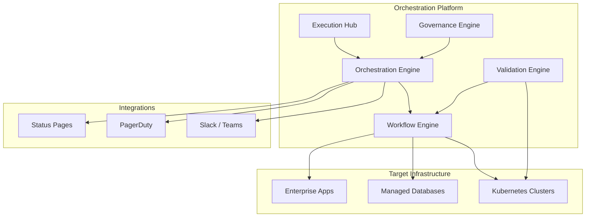

### 2. The Maintenance Execution Lifecycle
*From scheduled window to verified completion.*
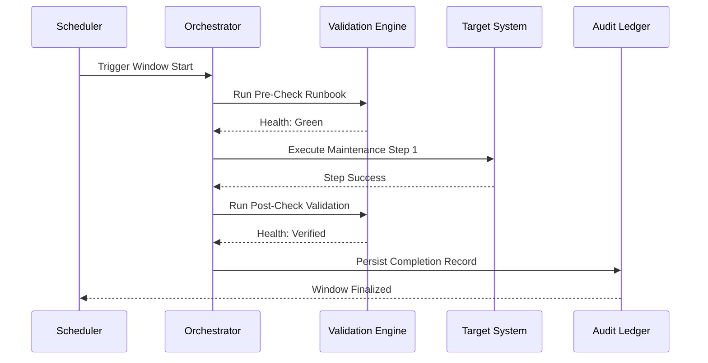

### 3. Dependency-Graph Conflict Detection
*Identifying cross-system impacts before execution.*
```mermaid
graph TD
    A[Window: DB Patching] -->|Dependency| B[App: Payment API]
    C[Window: Network Upgrade] -->|Conflict| A
    Note right of C: Conflict Detected: Shared Infrastructure
```

### 4. Automated Rollback State Machine
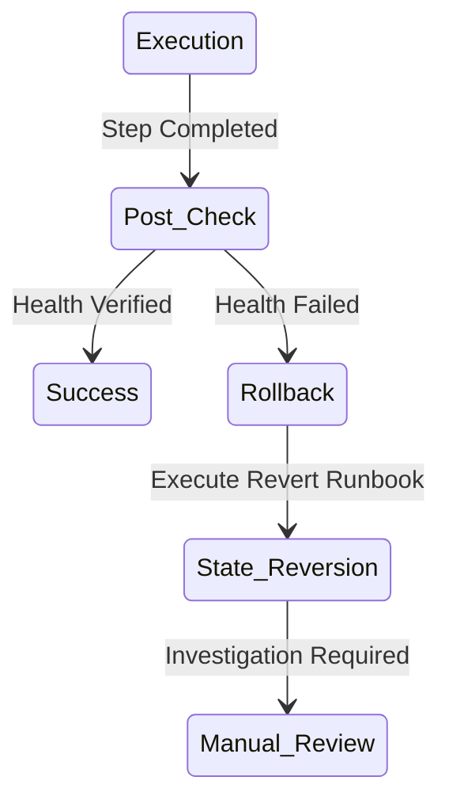

### 5. SLA-Aware Scheduling Logic
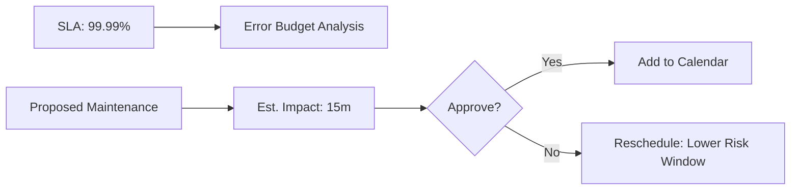

### 6. Multi-Region Coordination Flow
```mermaid
graph LR
    R1[Region: us-east-1] -->|Success| R2[Region: us-west-2]
    R2 -->|Success| R3[Region: eu-west-1]
    Note right of R1: Sequential Rollout Pattern
```

### 7. Blackout Window Enforcement
```mermaid
graph LR
    Request[Change Request] --> Policy[Policy: Peak Sales Period]
    Policy --> Block[Reject Schedule]
    Note right of Policy: Blackout Active (Dec 1-26)
```

### 8. Risk-Based Maintenance Scoring
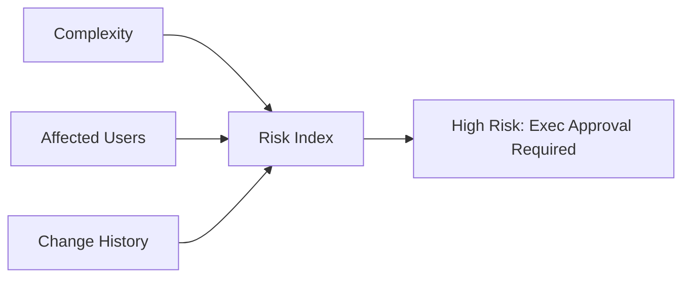

### 9. ChatOps Execution Flow
```mermaid
graph LR
    User[SRE] --> Slack[/maint approve MW-45]
    Slack --> Orch[Orchestrator]
    Orch --> Status[Update Status: Approved]
```

### 10. Communication Orchestration Loop
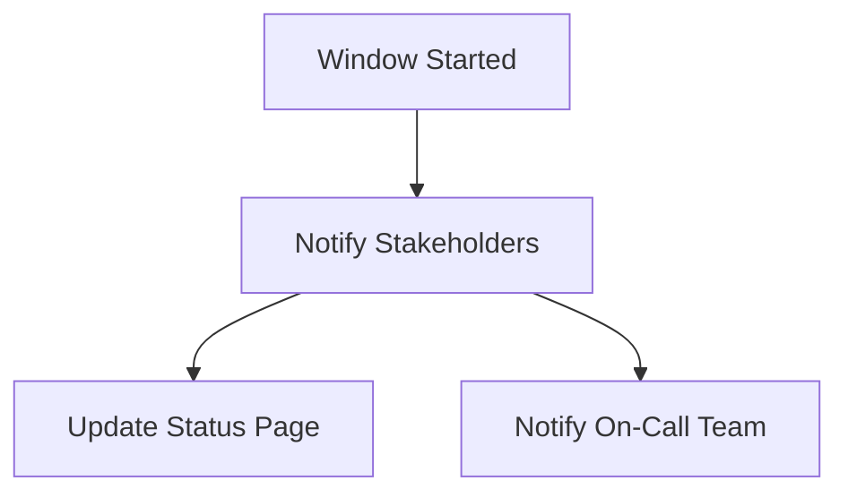

### 11. Centralized scheduling flow
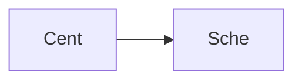

### 12. Multi-system orchestration
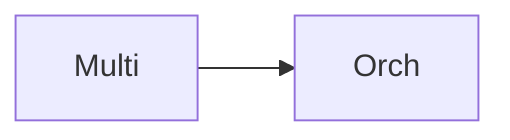

### 13. Dependency-aware sequencing
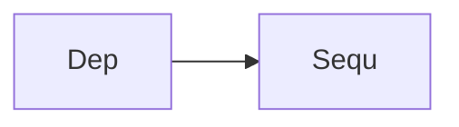

### 14. Change window governance
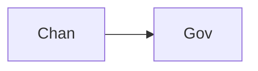

### 15. Pre-check automation flow
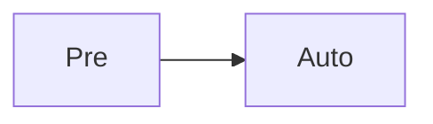

### 16. Post-check automation flow
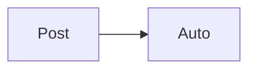

### 17. Approval workflow flow
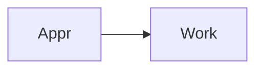

### 18. Communication orchestration
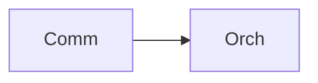

### 19. SLA-aware scheduling
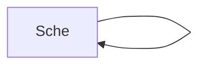

### 20. Blackout window flow
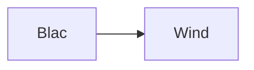

### 21. Risk scoring flow
```mermaid
graph LR
    R[Risk] --> S[Scor]
```

### 22. Rollback automation flow
```mermaid
graph LR
    R[Roll] --> A[Auto]
```

### 23. Incident linkage flow
```mermaid
graph LR
    I[Inci] --> L[Link]
```

### 24. Change audit logging
```mermaid
graph LR
    C[Chan] --> A[Audi]
```

### 25. Multi-region coordination
```mermaid
graph LR
    M[Multi] --> C[Coor]
```

### 26. Blue/Green maintenance
```mermaid
graph LR
    B[Blue] --> M[Main]
```

### 27. Canary maintenance flow
```mermaid
graph LR
    C[Cana] --> M[Main]
```

### 28. Runbook automation flow
```mermaid
graph LR
    R[Runb] --> A[Auto]
```

### 29. ChatOps integration flow
```mermaid
graph LR
    C[Chat] --> I[Inte]
```

### 30. Executive dashboard flow
```mermaid
graph LR
    E[Exec] --> D[Dash]
```

### 31. Orchestration engine pipeline
```mermaid
graph LR
    O[Orch] --> E[Engi]
```

### 32. Workflow engine flow
```mermaid
graph LR
    W[Work] --> E[Engi]
```

### 33. Validation engine flow
```mermaid
graph LR
    V[Vali] --> E[Engi]
```

### 34. Notification engine flow
```mermaid
graph LR
    N[Noti] --> E[Engi]
```

### 35. Kubernetes integration
```mermaid
graph LR
    K[Kuber] --> I[Inte]
```

### 36. AWS integration flow
```mermaid
graph LR
    A[AWS] --> I[Inte]
```

### 37. Azure integration flow
```mermaid
graph LR
    A[Azur] --> I[Inte]
```

### 38. GCP integration flow
```mermaid
graph LR
    G[GCP] --> I[Inte]
```

### 39. CI/CD integration flow
```mermaid
graph LR
    C[CICD] --> I[Inte]
```

### 40. PagerDuty integration
```mermaid
graph LR
    P[Page] --> I[Inte]
```

### 41. Slack integration flow
```mermaid
graph LR
    S[Slac] --> I[Inte]
```

### 42. Teams integration flow
```mermaid
graph LR
    T[Team] --> I[Inte]
```

### 43. Infrastructure: Network
```mermaid
graph LR
    I[Infr] --> N[Netw]
```

### 44. Infrastructure: Compute
```mermaid
graph LR
    I[Infr] --> C[Comp]
```

### 45. Infrastructure: Database
```mermaid
graph LR
    I[Infr] --> D[Data]
```

### 46. Monitoring: Prometheus
```mermaid
graph LR
    M[Moni] --> P[Prom]
```

### 47. Monitoring: Grafana
```mermaid
graph LR
    M[Moni] --> G[Graf]
```

### 48. Monitoring: Alerts
```mermaid
graph LR
    M[Moni] --> A[Aler]
```

### 49. CI/CD: Build pipeline
```mermaid
graph LR
    C[CICD] --> B[Buil]
```

### 50. CI/CD: Test pipeline
```mermaid
graph LR
    C[CICD] --> T[Test]
```

### 51. CI/CD: Deploy pipeline
```mermaid
graph LR
    C[CICD] --> D[Depl]
```

### 52. Maint UI: Calendar
```mermaid
graph LR
    U[UI] --> C[Cale]
```

### 53. Maint UI: Status
```mermaid
graph LR
    U[UI] --> S[Stat]
```

### 54. Maint UI: Risks
```mermaid
graph LR
    U[UI] --> R[Risk]
```

### 55. Maint UI: SLA
```mermaid
graph LR
    U[UI] --> S[SLA]
```

### 56. API: Window list
```mermaid
graph LR
    A[API] --> W[Wind]
```

### 57. API: Window create
```mermaid
graph LR
    A[API] --> C[Crea]
```

### 58. API: Execution run
```mermaid
graph LR
    A[API] --> E[Exec]
```

### 59. API: Rollback trigger
```mermaid
graph LR
    A[API] --> R[Roll]
```

### 60. Worker: Scheduling
```mermaid
graph LR
    W[Work] --> S[Sche]
```

### 61. Worker: Orchestration
```mermaid
graph LR
    W[Work] --> O[Orch]
```

### 62. Worker: Validation
```mermaid
graph LR
    W[Work] --> V[Vali]
```

### 63. Worker: Notification
```mermaid
graph LR
    W[Work] --> N[Noti]
```

### 64. Worker: Audit
```mermaid
graph LR
    W[Work] --> A[Audi]
```

### 65. Conflict detection flow
```mermaid
graph LR
    C[Conf] --> D[Dete]
```

### 66. Health check loop
```mermaid
graph LR
    H[Heal] --> C[Chec]
```

### 67. Rollback sequence
```mermaid
graph LR
    R[Roll] --> S[Sequ]
```

### 68. Approval gate flow
```mermaid
graph LR
    A[Appr] --> G[Gate]
```

### 69. Stakeholder notification
```mermaid
graph LR
    S[Stak] --> N[Noti]
```

### 70. Status page update
```mermaid
graph LR
    S[Stat] --> P[Page]
```

### 71. Region failover flow
```mermaid
graph LR
    R[Regi] --> F[Fail]
```

### 72. Deployment blue/green
```mermaid
graph LR
    D[Depl] --> B[Blue]
```

### 73. Deployment canary
```mermaid
graph LR
    D[Depl] --> C[Cana]
```

### 74. Transformation roadmap
```mermaid
graph LR
    T[Tran] --> R[Road]
```

### 75. Value realization model
```mermaid
graph LR
    V[Valu] --> R[Real]
```

### 76. Institutional maturity
```mermaid
graph LR
    I[Inst] --> M[Matu]
```

### 77. Evidence collection flow
```mermaid
graph LR
    E[Evid] --> C[Coll]
```

### 78. Compliance audit trail
```mermaid
graph LR
    C[Comp] --> A[Audi]
```

### 79. Strategy execution loop
```mermaid
graph LR
    S[Stra] --> E[Exec]
```

### 80. Orchestration ecosystem
```mermaid
graph LR
    O[Orch] --> E[Ecos]
```

---

## 🛠️ Technical Stack & Implementation

### Orchestration & Workflow Engine
- **Processing**: Python 3.11+ / FastAPI / Celery
- **Logic**: Dependency-Graph Execution, SLA-Aware Scheduling, Automated Health Checks.
- **Backend**: PostgreSQL (Change Ledger), Redis (Execution Queue).

### Frontend (Execution Hub)
- **Framework**: React 18 / Vite
- **Visuals**: Recharts (Execution Success, Severity Breakdown, SLA Impact).
- **Theme**: Slate, Amber, and Rose (Institutional Operations Aesthetics).

### Infrastructure
- **Cloud**: AWS EKS (Runtime), RDS (Persistence).
- **IaC**: Terraform (VPC, K8s, Database, IAM).

---

## 🚀 Deployment Guide

### Local Development
```bash
# Clone the repository
git clone https://github.com/devopstrio/maintenance-window-orchestrator.git
cd maintenance-window-orchestrator

# Setup environment
cp .env.example .env

# Launch services
make up
```
Access the Execution Hub at `http://localhost:3000`.

---

## 📜 License
Distributed under the MIT License. See `LICENSE` for more information.
