<div align="center">


<h1>Maintenance Window Orchestrator</h1>

<p><strong>The Institutional-Grade Platform for Change Coordination, Automated Orchestration, and Zero-Disruption Maintenance Governance.</strong></p>

[]()
[]()
[]()

<br/>

> **"Uncoordinated maintenance is the primary catalyst for institutional downtime."** 
> **Maintenance Window Orchestrator** is an enterprise-grade platform designed to provide a secure, measurable, and highly automated foundation for global operations. It orchestrates the complex lifecycle of maintenance activities—from cross-cloud window scheduling and automated pre-checks to sequential multi-service patching and unified change governance.

</div>

---

## 🏛️ Executive Summary

Uncoordinated maintenance windows and manual "heroic" patching processes are strategic operational liabilities; lack of centralized change orchestration is a primary barrier to organizational reliability. Organizations fail to achieve zero-disruption maintenance not because of a lack of tools, but because of fragmented scheduling standards, lack of automated readiness validation, and an inability to orchestrate change windows with operational precision.

This platform provides the **Operational Intelligence Plane**. It implements a complete **Enterprise Orchestration-as-Code Framework**, enabling SRE and Operations teams to manage global maintenance activities as first-class citizens. By automating the verification of system readiness and orchestrating real-time patching sequences, we ensure that every organizational update—from critical OS patching to cluster-wide reboots—is validated by default, audited for history, and strictly aligned with institutional change management frameworks.

---

## 📐 Architecture Storytelling: Principal Reference Models

### 1. Principal Architecture: Global Maintenance Window Orchestration & Operational Intelligence Plane
This diagram illustrates the end-to-end flow from cross-cloud window scheduling and automated readiness checks to sequential patching, incident-aware suppression, and institutional maintenance auditing.

```mermaid
graph LR
    %% Subgraph Definitions
    subgraph MaintenanceScheduling["Change & Window Scheduling"]
        direction TB
        AWS_SSM["AWS Systems Manager"]
        Azure_Auto["Azure Automation"]
        GCP_OS["GCP OS Config"]
    end

    subgraph IntelligenceEngine["Operational Intelligence Hub"]
        direction TB
        API["FastAPI Orchestration Gateway"]
        ReadinessEngine["Automated Readiness Verifier"]
        SequenceOrch["Patching & Reboot Orchestrator"]
        IncidentGate["Incident Suppression Logic"]
    end

    subgraph ExecutionPlane["Distributed Operational Fleet"]
        direction TB
        PatchWorkers["Automated Patching Workers"]
        ClusterNodes["K8s / VM Cluster Nodes"]
        StatusFeed["Real-Time Status Aggregator"]
    end

    subgraph OperationsHub["Institutional Maintenance Hub"]
        direction TB
        Scorecard["Maintenance Maturity Score"]
        Analytics["Patching & Uptime Stats"]
        Audit["Forensic Maintenance Metadata Lake"]
    end

    subgraph DevOps["Orchestration-as-Code Framework"]
        direction TB
        TF["Terraform Orchestration Modules"]
        SOPs["Automated Repair Runbooks"]
        ChatOps["Change Approval Hub"]
    end

    %% Flow Arrows
    MaintenanceScheduling -->|1. Submit Window| API
    API -->|2. Verify Readiness| ReadinessEngine
    ReadinessEngine -->|3. Sequence Steps| SequenceOrch
    SequenceOrch -->|4. Check Incidents| IncidentGate
    
    IncidentGate -->|5. Execute Window| ExecutionPlane
    ExecutionPlane -->|6. Notify Progress| ChatOps
    API -->|7. Visualize Health| Scorecard
    
    Scorecard -->|8. Track Success| Analytics
    Scorecard -->|9. Record Event| Audit
    
    TF -->|10. Provision Hub| IntelligenceEngine
    SOPs -->|11. Inject Recovery| SequenceOrch
    Audit -->|12. Improve Windows| ReadinessEngine

    %% Styling
    classDef schedule fill:#f5f5f5,stroke:#616161,stroke-width:2px;
    classDef intel fill:#fff8e1,stroke:#ff8f00,stroke-width:2px;
    classDef execution fill:#e1f5fe,stroke:#01579b,stroke-width:2px;
    classDef ops fill:#ede7f6,stroke:#311b92,stroke-width:2px;
    classDef devops fill:#e8f5e9,stroke:#1b5e20,stroke-width:2px;

    class MaintenanceScheduling schedule;
    class IntelligenceEngine intel;
    class ExecutionPlane execution;
    class OperationsHub ops;
    class DevOps devops;
```

### 2. The Maintenance Lifecycle Flow
The continuous path of a maintenance window from initial scheduling and pre-checks to active execution, post-validation, and institutional forensic auditing.

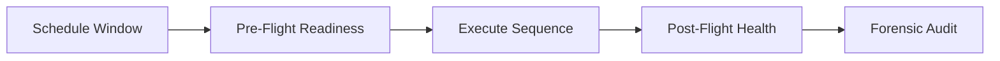

### 3. Cross-Cloud Maintenance Scheduling Topology
Strategically coordinating maintenance windows across disparate cloud provider native tools (AWS SSM, Azure Automation, GCP OS Config) into a unified institutional view of global change.

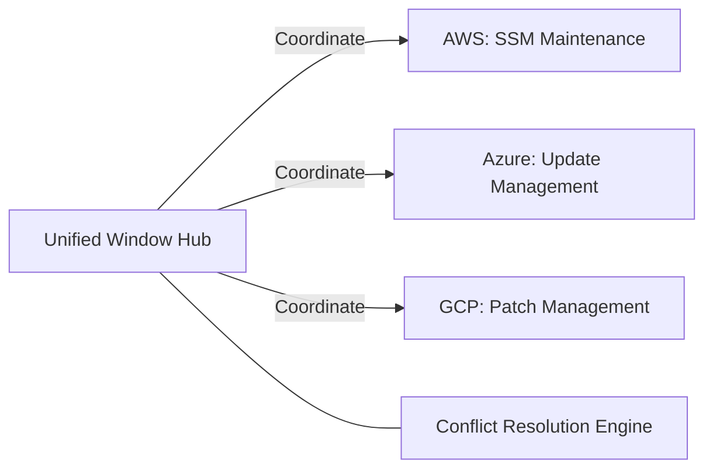

### 4. Automated Pre-Maintenance Readiness Flow
Executing a battery of automated checks—verifying recent backups, validating current cluster health, and confirming team availability—before any maintenance step is permitted.

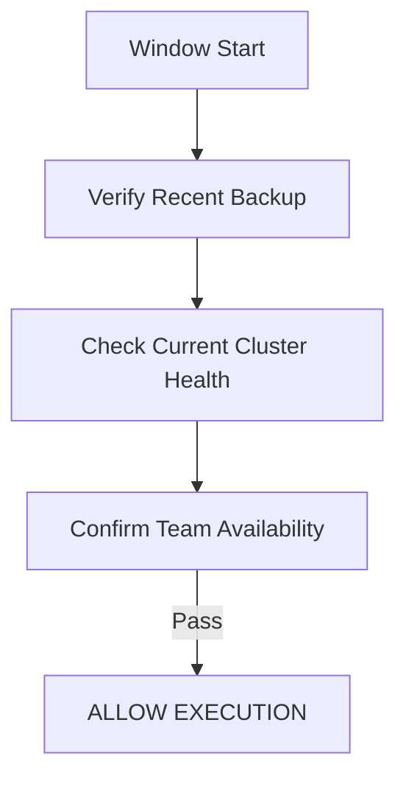

### 5. Multi-Service Patching & Reboot Orchestration Flow
Managing the sequential restart of interconnected services, ensuring that dependent systems are patched and healthy before moving to the next tier of the infrastructure.

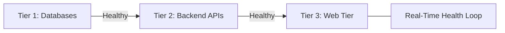

### 6. Incident-Aware Maintenance Suppression Flow
Automatically suppressing, delaying, or canceling maintenance windows if a high-severity active incident is detected in the environment, preventing "Change on Fire" scenarios.

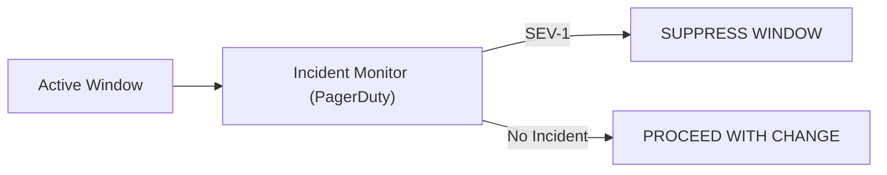

### 7. Institutional Maintenance Scorecard
Grading organizational performance based on key indicators: Maintenance Success Rate, Patching Compliance Coverage, and Automated Rollback Frequency.

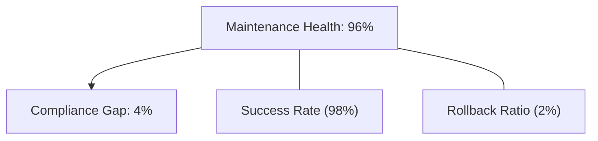

### 8. Identity & RBAC for Maintenance Governance
Managing fine-grained access to window schedules, execution triggers, and audit logs between Operations Leads, SREs, and Change Managers.

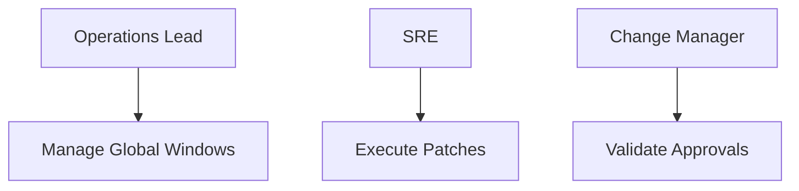

### 9. IaC Deployment: Orchestration-as-Code Framework
Using modular Terraform to deploy and manage the versioned distribution of the maintenance tracking hubs, readiness workers, and forensic metadata lakes.

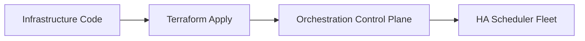

### 10. AIOps Maintenance Anomaly Detection Flow
Using advanced analytics to identify unusually slow patching cycles or recurring failure patterns, identifying potential system degradation before it impacts production.

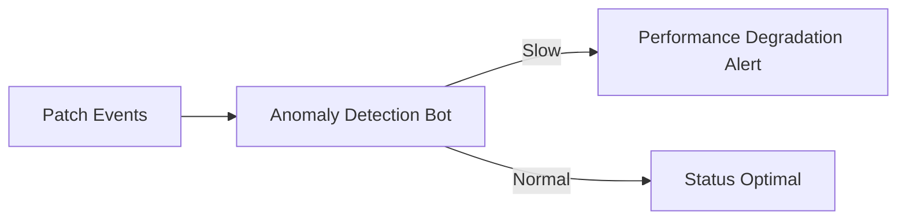

### 11. Metadata Lake for Forensic Maintenance Audit
Storing long-term records of every window executed, every command run, and every outcome for institutional record-keeping, compliance auditing, and post-incident forensics.

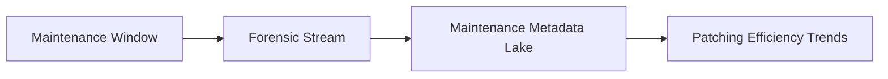

---

## 🏛️ Core Orchestration Pillars

1.  **Unified Change Coordination**: Maximizing uptime by preventing overlapping or conflicting maintenance activities.
2.  **Automated Readiness Validation**: Eliminating "failed start" scenarios through proactive health and backup verification.
3.  **Sequential Patching Intelligence**: Ensuring zero-downtime through dependency-aware service restarts.
4.  **Incident-Aware Protection**: Automatically pausing changes during active production instability.
5.  **Autonomous Recovery Logic**: Guaranteeing service restoration through automated rollback runbooks.
6.  **Full Change Auditability**: Immutable recording of every command and outcome for institutional forensics.

---

## 🛠️ Technical Stack & Implementation

### Orchestration Engine & APIs
*   **Framework**: Python 3.11+ / FastAPI.
*   **Cloud Connector**: Integration with AWS SSM, Azure Automation, and GCP OS Config APIs.
*   **Orchestrator**: Custom Python-based dependency resolution and sequencing engine.
*   **Persistence**: PostgreSQL (Metadata Lake) and Redis (Live Execution State).
*   **Auth Orchestrator**: Federated OIDC/SAML for least-privilege change management access.

### Execution Dashboard (UI)
*   **Framework**: React 18 / Vite.
*   **Theme**: Dark, Amber, Slate (Modern high-fidelity operations aesthetic).
*   **Visualization**: D3.js for dependency graphs and Recharts for patching compliance analytics.

### Infrastructure & DevOps
*   **Runtime**: AWS EKS or Azure Kubernetes Service (AKS).
*   **Incident Bridge**: Real-time integration with PagerDuty and ServiceNow APIs.
*   **IaC**: Modular Terraform for deploying the maintenance platform and scheduler distributions.

---

## 🏗️ IaC Mapping (Module Structure)

| Module | Purpose | Real Services |
| :--- | :--- | :--- |
| **`infrastructure/orch_hub`** | Central management plane | EKS, PostgreSQL, Redis |
| **`infrastructure/connectors`** | Multi-cloud API adapters | Lambda, Python, SDKs |
| **`infrastructure/workers`** | Readiness & Patching fleet | K8s Workers, SSH, SSM |
| **`infrastructure/auditing`** | Forensic maintenance sinks | S3, Athena, Quicksight |

---

## 🚀 Deployment Guide

### Local Principal Environment
```bash
# Clone the orchestration platform
git clone https://github.com/devopstrio/maintenance-window-orchestrator.git
cd maintenance-window-orchestrator

# Configure environment
cp .env.example .env

# Launch the Orchestrator stack
make init

# Trigger a mock maintenance window and sequential patching simulation
make simulate-orchestrator
```

Access the Execution Hub at `http://localhost:3000`.

---

## 📜 License
Distributed under the MIT License. See `LICENSE` for more information.

---
<div align="center">
  <p>© 2026 Devopstrio. All rights reserved.</p>
</div>
