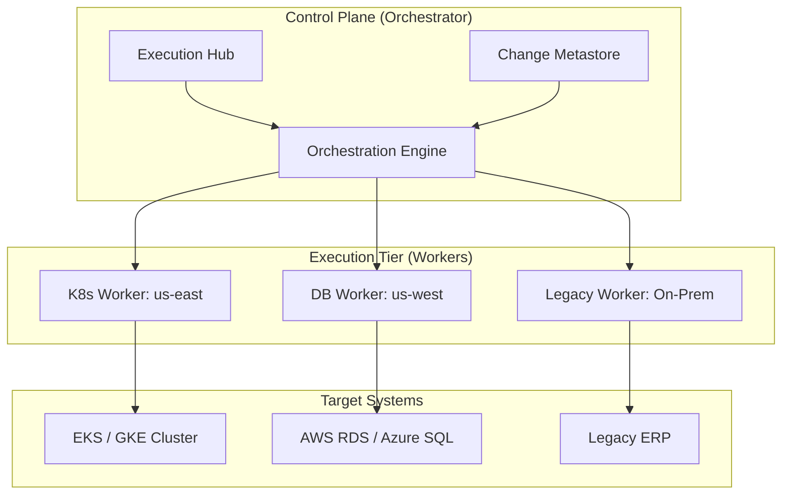
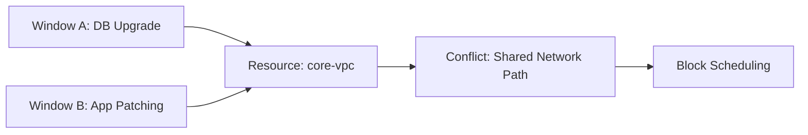
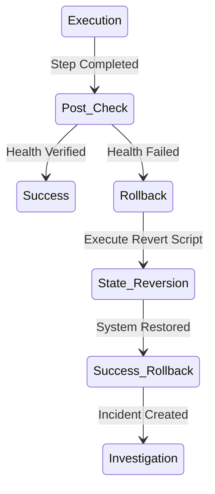

# Architecture & Orchestration Diagrams

## 11. End-to-End Orchestration Topology (Detailed)
*How the platform orchestrates maintenance across multi-cloud clusters.*

## 13. "Conflict Detection" Logic

## 20. Automated Rollback Pipeline

