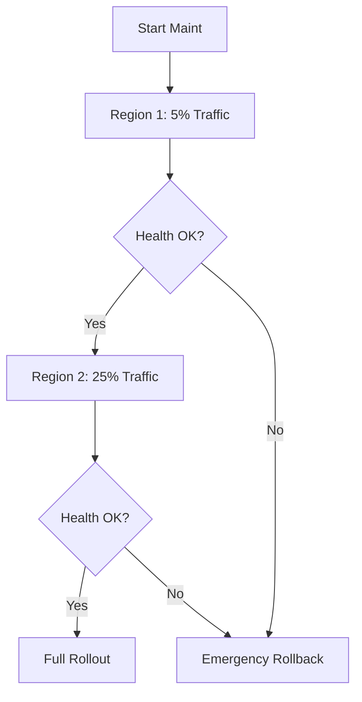
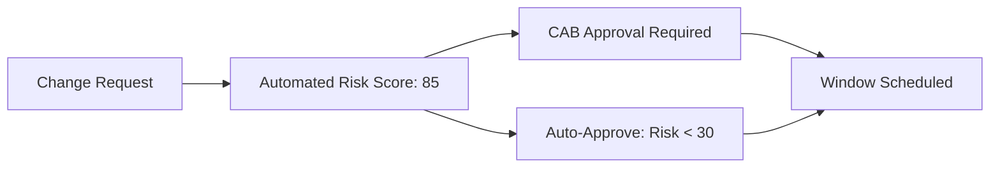
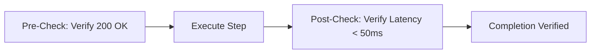

# Operations & Governance Diagrams

## 31. Multi-Region Canary Maintenance

```mermaid
graph TD
    Start[Start Maint] --> R1[Region 1: 5% Traffic]
    R1 --> Check1{Health OK?}
    Check1 -->|Yes| R2[Region 2: 25% Traffic]
    R2 --> Check2{Health OK?}
    Check2 -->|Yes| R3[Full Rollout]
    Check1 -->|No| Halt[Emergency Rollback]
    Check2 -->|No| Halt
```

## 34. Change Approval Workflow

```mermaid
graph LR
    Request[Change Request] --> Risk[Automated Risk Score: 85]
    Risk --> CAB[CAB Approval Required]
    CAB --> Approved[Window Scheduled]
    Risk --> Auto[Auto-Approve: Risk < 30]
    Auto --> Approved
```

## 40. "Health-as-Code" Validation Loop

```mermaid
graph LR
    Pre[Pre-Check: Verify 200 OK] --> Exec[Execute Step]
    Exec --> Post[Post-Check: Verify Latency < 50ms]
    Post --> Verify[Completion Verified]
```
